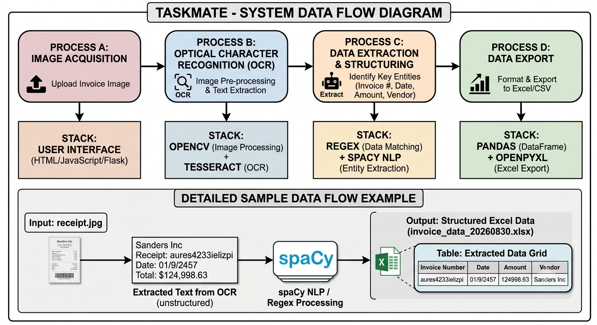
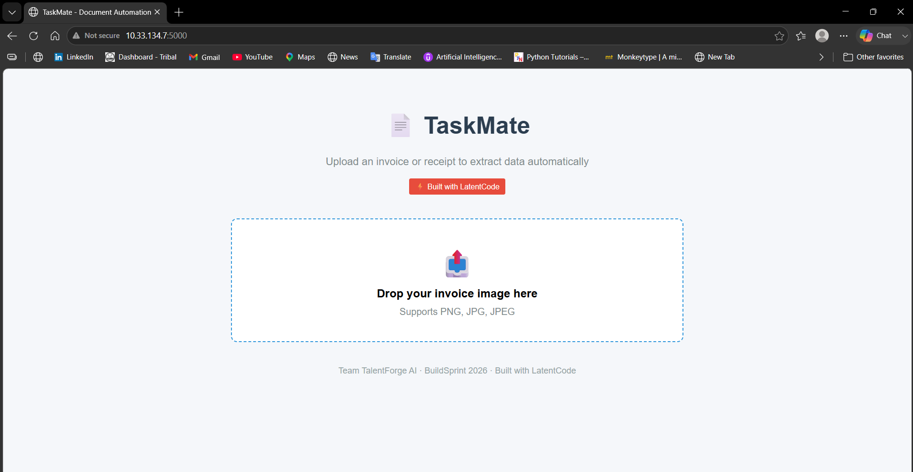
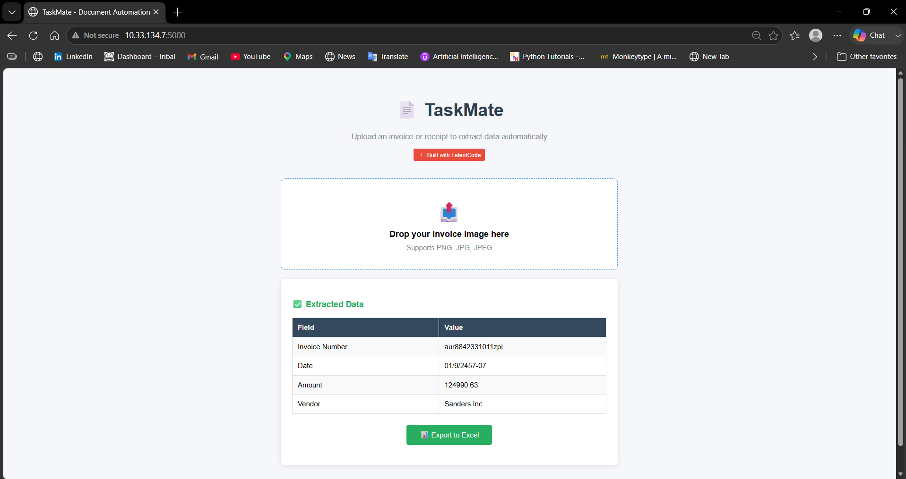

# 📄 TaskMate - AI-Powered Document to Task Automation

> **"Turn hours of manual data entry into seconds of automation."**

[](https://latentstack.dev)
[](https://python.org)
[](https://flask.palletsprojects.com)
[](https://github.com/tesseract-ocr/tesseract)
[](LICENSE)
[](https://unstop.com/p/buildsprint-latentforceai-1742504)

---
## 🎯 The Problem

Every day, millions of students, accountants, and small business owners waste hours manually copying data from invoices, receipts, and forms into Excel spreadsheets.

**The cost?**
- ⏱️ **Hours lost** - 50 invoices = ~54 minutes of typing
- ❌ **Human errors** - Typos, missing data, costly mistakes
- 🔒 **Privacy concerns** - Cloud tools expose sensitive financial data
- 💸 **Paid APIs** - Monthly subscriptions for basic extraction

**This is the problem TaskMate solves.**

---

## 💡 The Solution
📤 Upload Image → 🔍 OCR Processing → 🤖 AI Extraction → 📊 Export to Excel


### What It Extracts

| Field | Example |
|-------|---------|
| 📋 **Invoice Number** | `aures4233ielizpi` |
| 📅 **Date** | `01/9/2457` |
| 💰 **Amount** | `$124,998.63` |
| 🏢 **Vendor** | `Sanders Inc` |

---

## ✨ Key Features

| Feature | Description |
|---------|-------------|
| 🔒 **100% Offline** | Your data never leaves your computer |
| 💸 **Zero API Costs** | No subscriptions, no hidden fees |
| 🚀 **90% Faster** | 65 seconds → 12 seconds per invoice |
| ✅ **Zero Errors** | AI extraction eliminates typos |
| 📊 **Excel Export** | One-click export to Excel/CSV |
| 🎨 **Clean UI** | Intuitive drag-and-drop interface |
| 🔐 **Privacy First** | Sensitive data stays on your device |
| 🖼️ **Image Preprocessing** | OpenCV enhances image quality for better OCR |

---

## 🛠️ Tech Stack

| Technology | Purpose |
|------------|---------|
| **LatentCode** | AI coding assistant (BuildSprint required) |
| **Python 3.12** | Core programming language |
| **Flask 3.1.3** | Web framework for UI |
| **Tesseract OCR** | Text extraction from images |
| **OpenCV** | Image preprocessing for better OCR accuracy |
| **spaCy** | NLP for intelligent data extraction |
| **pandas** | Excel/CSV export |
| **Pillow** | Image processing |

## 🚀 Getting Started

Follow these steps to get TaskMate running on your local machine in under 5 minutes.

### Prerequisites

Before you begin, ensure you have met the following requirements:

- **Python 3.12+** installed on your system.
- **Tesseract OCR** installed and added to your system PATH.
  - *Windows:* Download from [UB Mannheim](https://github.com/UB-Mannheim/tesseract/wiki)
  - *macOS:* `brew install tesseract`
  - *Linux:* `sudo apt-get install tesseract-ocr`
- **Git** for cloning the repository.

### Installation

1. **Clone the repository**
   ```bash
   git clone https://github.com/tanu91112/TaskMate---AI-powered-document-automation.git
   cd TaskMate---AI-powered-document-automation

# Windows
python -m venv venv
venv\Scripts\activate

# macOS/Linux
python3 -m venv venv
source venv/bin/activate

#Install dependencies
pip install -r requirements.txt


---
## 🏗️ Architecture

The diagram below illustrates the flow of data through TaskMate, from image upload to Excel export.



*Figure 1: TaskMate System Architecture - End-to-end data flow from user upload to Excel export.*

---

### 📸 Screenshots

Here are the additional screenshots:




---

### 🔄 Data Flow

TaskMate is an **offline-first, AI-powered document automation tool** that extracts key information from invoices and receipts with one click.

### How It Works
📤 Upload → 🔍 OCR Processing → 🤖 AI Extraction → 📊 Export to Excel

## 📄 License

Distributed under the MIT License. See `LICENSE` for more information.

---

## 👨‍💻 Contact

**Project Maintainer:** Tanu
- **GitHub:** [@tanu91112](https://github.com/tanu91112)
- **Project Link:** [https://github.com/tanu91112/TaskMate---AI-powered-document-automation](https://github.com/tanu91112/TaskMate---AI-powered-document-automation)

